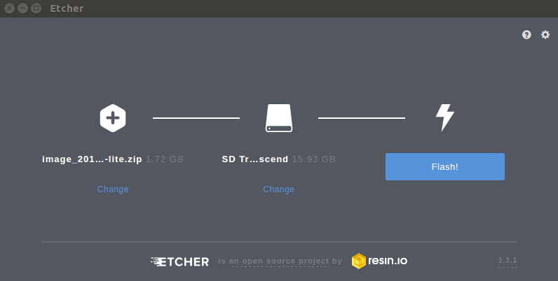

# Get Started

## Downloading image

The latest, pre-build image of Vitrobian can be downloaded from the following
[link](https://s3-eu-west-1.amazonaws.com/prod-vitrobian-releases/vitrobian_0.2.0.img.gz).

## Image flashing

### Using GUI

The easiest way to flash image on all system platforms is to use `etcher`. It
is multi-platform application that is available for Linux, Windows or macOS.

* Download and install [etcher](https://etcher.io/).

* Insert the SD card to the SD card reader of your host PC.

* Run etcher.

* Click on `Select Image` and select `vitrobian_0.2.0.img.gz`.
There is no need to unpack the image first.

   The SD card reader should be picked automatically. If more than one readers
   are present, click on `Change` and select the one you want to use.

   Configured application window should look similar to this one (SD card
   reader name may vary):

   

* When confirmed, click on the `Flash` button to start flashing procedure.
Depending on your setup, you will be prompted for `sudo user` or
`administrator` password.

### Using CLI

Other way is to use CLI. In order to flash image, execute the command below:

   ```
   gzip -cdk vitrobian_0.2.0.img.gz | sudo dd of=/dev/sdX bs=16M status=progress
   ```

   Replacing `sdX` with the descriptor of the block device corresponding to the
   `SD card`. For instance:

   ```
   gzip -cdk vitrobian_0.2.0.img.gz | sudo dd of=/dev/sdc bs=16M status=progress
   ```

## Vitro Crystal platform configuration

* Make sure, that jumper is attached on the `1-2` pins of `J12` header and
switches (`SW2`) are configured as below:

   | Switch number | 1 | 2 | 3 | 4 | 5 | 6 | 7 | 8 |
   |---------------|---|---|---|---|---|---|---|---|
   | Value         | 1 | 0 | 1 | 0 | 0 | 0 | 1 | 0 |

* Insert the SD card into the Vitro Crystal.

* Connect Ethernet cable and power supply for the board

### Login to the Vitrobian Crystal

You can login to the Vitrobian Crystal in two ways:

* by connection to Vitro Crystal using serial port

* by connection to Vitro Crystal using SSH

The second way is easier, so we'll try this solution. Firstly we have to check
local IP of Vitrobian Crystal board. For this purpose, execute following command
on your computer:

```
ping crystal.local
```

Output should be similar to below:

```
PING crystal.local (192.168.4.178) 56(84) bytes of data.
64 bytes from 192.168.4.178 (192.168.4.178): icmp_seq=1 ttl=64 time=0.184 ms
64 bytes from 192.168.4.178 (192.168.4.178): icmp_seq=2 ttl=64 time=0.243 ms
64 bytes from 192.168.4.178 (192.168.4.178): icmp_seq=3 ttl=64 time=0.204 ms
```

* When we know IP, we can start connection and login to the system. If you are
using Linux or macOS, just open a terminal window and enter the following
command:

   ```
   ssh user@<vitro-crystal-ip-address>
   ```

   Please change the `<vitro-crystal-ip-address>` to address obtained in previous
   step.

* Login to `Vitrobian` using credentials:

   ```
   Login: user
   Password: user
   ```

When you are a Windows user, you can use
[PuTTY](https://www.chiark.greenend.org.uk/~sgtatham/putty/latest.html).
